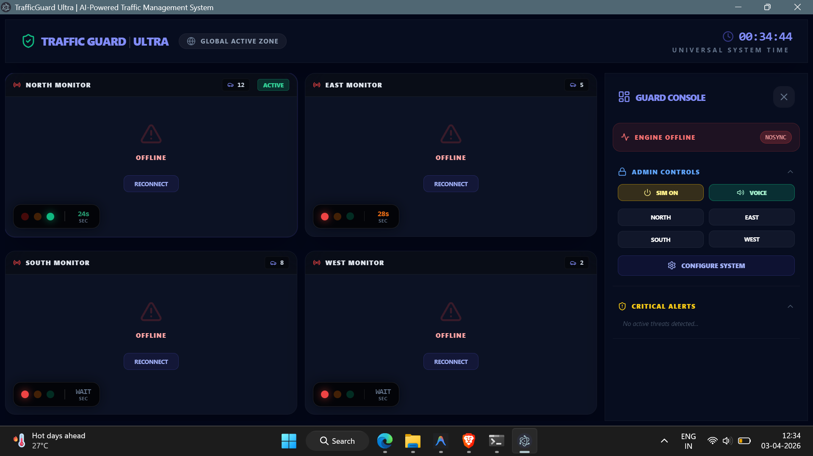

# 🚦 TrafficGuard : Next-Gen Urban Traffic Management 



> [!CAUTION]
> **PROPRIETARY SYSTEM**: This project is the intellectual property of **Prince**. No unauthorized copying, distribution, or commercial use is permitted without written consent. See [LICENSE](file:///c:/Users/princ/Desktop/New%20folder/Traffic-AI-Project/LICENSE) for details.

---

**TrafficGuard AI** is a cutting-edge, enterprise-grade traffic control solution that combines **Computer Vision (YOLOv8)**, **Adaptive Logic Algorithms**, and **Hardware Integration** to solve modern urban congestion challenges. 

Developed with a focus on high-performance, low-latency, and real-world applicability, this system is capable of managing complex 4-way intersections entirely on standard hardware (CPU) without the need for expensive GPUs.

---

## 💎 Premium Features

### 1. 🧬 Hyper-Adaptive Signal Logic
Our custom-built **TrafficController** doesn't just switch lights based on time; it thinks in real-time.
- **Dynamic Green Duration**: Signal time scales automatically (30s, 60s, 90s) based on vehicle density.
- **Empty-Lane Optimization (Early Switch)**: If a lane clears out, the system detects it within 1 second and immediately transfers control to the next waiting lane, saving thousands of hours of idling time.
- **Priority Waiting Score**: Prevents " starvation" by tracking how long a lane has been waiting. If a lane waits >120s, it gets emergency priority.

### 2. 🔌 IoT & Hardware Ready
This isn't just software. It's ready for a physical lab prototype or real-world deployment.
- **Arduino Integration**: Direct Serial communication to control LEDs and Relays.
- **Wiring Guide Included**: Complete pin mapping for Arduino Uno to 12-lamp traffic signal arrays.

### 4. 🚀 Ultra-Performance Backend
- **Asynchronous WebSocket Broadcasting**: Updates all connected clients and hardware links simultaneously with sub-50ms latency.
- **ONNX Inference**: 3x speed boost on standard CPUs, making expensive GPUs unnecessary.

### 5. ⚡ One-Click Command Center (New)
No more complex terminal commands. We've added a master launcher for an effortless startup.
- **`Launch_Traffic_AI.bat`**: A single click starts the Python AI Engine, the Next.js Server, and the Electron Desktop Window automatically.

### 6. 📸 Plug-and-Play Camera Detection
The system automatically scans your computer for connected USB cameras (Webcams). 
- If a camera is found (at index 0, 1, 2, or 3), it uses the **Live Hardware Feed**. 
- If no camera is detected, it automatically falls back to an **Intel Sample Video** for a seamless demonstration.

---

## 🏗️ Development Workflow & Live Updates

This project is built for **Rapid Prototyping**. If you are a developer, here is how you can work with it:

### 1. Frontend Changes (UI)
- **Hot Module Replacement (HMR)**: Any changes you make in the `frontend-next/` folder (React components, CSS, etc.) will be reflected **instantly** in the Desktop App window without restarting.

### 2. Backend Changes (Logic)
- If you modify the AI logic or timing algorithms in `backend/`, simply close the Backend terminal window and re-launch the system using the batch file.

### 3. Hardware Changes
- Arduino code updates require a fresh "Upload" via the Arduino IDE to the physical board.

### 4. 🎮 Full-Featured Simulation Mode
Perfect for exhibitions and demos.
- **Local Data Generator**: Click "SIM ON" to run the entire project without a camera or backend.
- **Predictive Red Timers**: Real-time orange countdowns on waiting lanes so drivers know exactly how long they need to wait.

---

## 🛠 Tech Stack

| Layer | Technologies |
| :--- | :--- |
| **Backend** | Python 3.10+, FastAPI, Uvicorn, Multiprocessing |
| **AI / CV** | Ultralytics (YOLOv8), ONNX Runtime, OpenCV |
| **Frontend** | Next.js 14 (App Router), TailwindCSS, Lucide Icons |
| **State Management** | Zustand (Ultra-fast sync) |
| **Hardware** | Arduino C++, Pyserial |

---

## 📂 Project Architecture

```text
Traffic-AI-Project/
├── backend/                  # The Central Nervous System
│   ├── main.py               # API & Broadcasting Hub
│   ├── controller.py         # Advanced Signal Logic (Weighted Algorithm)
│   ├── detector.py           # Computer Vision Engine
│   ├── engine.py             # Multiprocess Video Stream Processor
│   ├── utils/
│   │   ├── arduino_serial.py # Python-to-Hardware Bridge
│   │   └── metrics.py        # CPU/System Health Monitor
│   └── requirements.txt      # Python Dependencies
├── frontend-next/            # The Enterprise Command Center
│   ├── app/                  # Main UI Layouts
│   ├── components/           # Modular 
│   ├── store/                # Zustand Data Store
│   └── utils/
│       └── mockGenerator.js  # Virtual AI Simulator
└── hardware/                 # Physical Implementation Lab
    ├── arduino_controller.ino # C++ Code for Arduino
    └── connections.md        # Deep Wiring & Schematic Guide
```

---

## 🚀 Installation & Setup

### 1. Prerequisites
- **Python 3.10 or higher**
- **Node.js 18 or higher**
- **Arduino IDE** (if using hardware)

### 2. Quick Start (Desktop Mode)
1. Go to the project root folder.
2. Double-click **`Launch_Traffic_AI.bat`**.
3. Wait **12 seconds** for all services to synchronize.
4. The **Command Center** will open automatically.

### 3. Manual Launch (Development Mode)
```bash
# Terminal 1: Backend
cd backend
python main.py
cd frontend-next

# Install UI modules
npm install

# Start the dashboard
npm run dev
```
Open **[http://localhost:3000](http://localhost:3000)** in your browser or run the **Launch_Traffic_AI.bat** for a desktop experience.

---

## 🎥 Camera Setup

To use your physical cameras for traffic detection:
1.  Connect your USB camera(s) to the computer.
2.  Launch the system using the batch file.
3.  The backend will automatically assign:
    - **Camera 0** ➜ North Lane
    - **Camera 1** ➜ East Lane
    - **Camera 2** ➜ South Lane
    - **Camera 3** ➜ West Lane
4.  If a lane doesn't have a physical camera, it will use the default training video.

---

## 🚦 How to Use the Dashboard

1.  **Monitor Windows**: Each of the 4 grid segments shows the AI detection feed.
2.  **Simulation Toggle**: Use the **SIM ON/OFF** button in the sidebar to switch between real AI data and the internal demo generator.
3.  **Manual Override**: Use the **NORTH, EAST, SOUTH, WEST** buttons to force a specific signal to GREEN (Security/Emergency override).
4.  **Admin Portal**: Click "Configure System" to change ROI boxes, confidence levels, or default timings on-the-fly.

---

## 🔧 Hardware Wiring (Quick Guide)

- **Arduino Digital Pins**:
    - **North**: Red(2), Yellow(3), Green(4)
    - **East**: Red(5), Yellow(6), Green(7)
    - **South**: Red(8), Yellow(9), Green(10)
    - **West**: Red(11), Yellow(12), Green(13)
- **Serial Connection**: Ensure the USB is connected and `COM3` (default) is set in `backend/main.py`.

---

## ⚖️ Algorithm Explanation
We use a **Weighted Fairness Scoring** system:
`Priority Score = (V * λ) + (W / μ)`
- `V`: Current Vehicle Count
- `W`: Cumulative Wait Time
- `λ`: Density Multiplier (2.5)
- `μ`: Wait-Time Stabilizer (8.0)

This ensures that even a road with 1 car will eventually get a green light if it waits long enough, preventing it from being blocked by a road with 100 cars forever.

---

## 📜 Project Vision
*This project was built to rethink how cities approach congestion. By combining AI with hardware, we create a system that is not only smart but also physically actionable.*

Developed with ❤️ by **Prince**.

## ⚖️ License & Ownership
**© 2026 Prince (prince19112003)**. All Rights Reserved. 

Developed with ❤️ for Intelligent Traffic Solutions.
